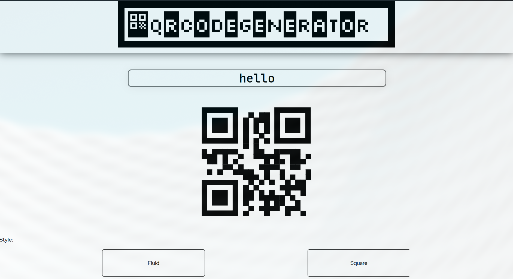

# QR Generator

## Description du projet
Il s'agit d'un générateur de QR code d'URL en temps réel, où l'on peut modifier la forme du code et la couleur du code et des indicateurs.
***
## Technologies utilisées
Le front du site est fait en HTML/CSS et utilise le framework ReactJS. L'application peut être conteneurisée par Docker grâce au Dockerfile. Le QR Code est généré grâce à [react-qrcode-logo-npm](https://www.npmjs.com/package/react-qrcode-logo).
***
## Déploiement du site
On peut déployer le site sur sa machine en faisant ```npm install``` pour installer les dépendances et ```npm start``` pour lancer l'application.
Pour lancer l'application sur Docker, il faut faire ```docker build . -t <nom qu'on veut donner au container>:<version qu'on veut donner au container>``` puis ```docker run -p 8080:3000 <nom du container>```. Dans les 2 méthodes, on se connecte sur le site à l'adresse https://localhost:8080
